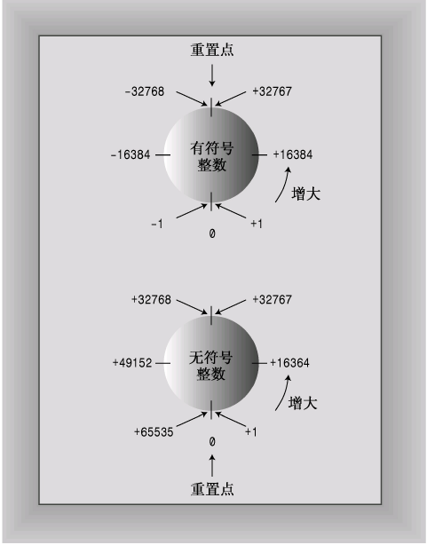

# 第3章 处理数据

## 3.1 简单变量

程序存储信息的3个基本属性：
* 信息存储在哪里
* 存储什么值
* 存储什么类型的信息

举例：
```
int braincount;
braincount = 5;
```
上述语句告诉程序，它正在存储整数，并使用名称braincount来表示该整数的值（5）。

实际上，程序先找到一块可以存储整数的内存，将该内存单元标记为braincount，并将5复制到该内存单元中；可以用braincount来访问该内存单元，也可以使用`&运算符来检索braincount的内存地址`。

### 3.1.1 变量名
C++ 命名规则如下：
* 名称只能包含字母、数字、下划线
* 名称第一个字符不能是数字
* 字母区分大小写
* 不能将C++关键字作为名称
* 以两个下划线及大写字母打头的名称保留给实现使用，以一个下划线开头的名称保留用作全局标识符
* C++名称没有长度限制

#### 3.1.2 整型
使用的内存越大，则可以存储的整数值范围越大。C++存储数据的宽度（使用内存越多，宽度越大）递增排序如下：
* char
* short
* int
* long
* long long(C++11新增)
上述类型都有**有符号和无符号**版本，所以有10种类型可选。

#### 3.1.3 整型short、int、long和long long

- short至少16位；
- int至少与short一样长；
- long至少32位，且至少与int一样长；
- long long至少64位，且至少与long一样长。


**位和字节**

计算机内存的基本单元是`位（也称比特，bit）`,用二进制的0或1来表示，0或1就代表一位。8位的内存可以有2X2X2X2X2X2X2X2=256种组合，可以表示0-255或者-128到127。

`字节(byte)`通常是指8位的内存单元， 1KB=1024byte, 1MB=1024KB.

sizeof运算符返回类型或变量的长度，单位为字节。
对类型名（如int）使用sizeof 时，int需要放在括号里，但对于变量名（n_short）使用sizeof时，可用可不用括号。
```
// limits.cpp -- some integer limits
#include<iostream>
#include<climits>

int main()
{
    using namespace std;
    int n_int = INT_MAX;
    short n_short = SHRT_MAX;
    long n_long = LONG_MAX;
    long long n_llong = LLONG_MAX;

    // sizeof operator yields size of type or of variable
    cout << "int is " << sizeof(int) << " bytes." << endl;
    cout << "short is " << sizeof n_short << " bytes." << endl;
    cout << "long is " << sizeof n_long << " bytes." << endl;
    cout << "long long is " << sizeof n_llong << " bytes." << endl;
    cout << endl;

    cout << "Maximum values:" << endl;
    cout << "int: " << n_int << endl;
    cout << "short: " << n_short << endl;
    cout << "long: " << n_long << endl;
    cout << "long long: " << n_llong << endl;

    cout << "Maximum int value = " << INT_MIN << endl;
    cout << "Bits per byte = " << CHAR_BIT << endl;
    return 0;

}

在linux环境中运行脚本结果为：
int is 4 bytes.
short is 2 bytes.
long is 8 bytes.
long long is 8 bytes.

Maximum values:
int: 2147483647
short: 32767
long: 9223372036854775807
long long: 9223372036854775807
Maximum int value = -2147483648
Bits per byte = 8
```

表3.1climits中的符号常量

|符 号 常 量|表 示|
|-|-|
CHAR_BIT| char的位数
CHAR_MAX| char的最大值
CHAR_MIN| char的最小值
SCHAR_MAX| signed char的最大值
SCHAR_MIN| signed char的最小值
UCHAR_MAX| unsigned char的最大值
SHRT_MAX| short的最大值
SHRT_MIN| short的最小值
USHRT_MAX| unsigned short的最大值
INT_MAX| int的最大值
INT_MIN| int的最小值
UNIT_MAX| unsigned int的最大值
LONG_MAX| long的最大值
LONG_MIN| long的最小值
ULONG_MAX| unsigned long的最大值
LLONG_MAX| long long的最大值
LLONG_MIN| long long的最小值
ULLONG_MAX| unsigned long long的最大值

> 符号常量-预处理器方式
在climits文件中包含下列类似的语句：

**#define INT_MAX 32767**

2. 初始化

初始化将赋值和声明合并在一起, 如下语句，声明了变量n_int, 并将int的最大值赋值给它。

int n_int = INT_MAX;


#### 3.1.4 无符号类型
无符号类型可以增大存储的最大值，当然要知道只有数值不为负数时才能使用无符号类型。

```
// exceed.cpp -- exceeding some integer limits
#include <iostream>
#include <climits>
#define ZERO 0

int main()
{
    using namespace std;
    short short_max = SHRT_MAX;
    short short_min = SHRT_MIN;
    cout << "short_max: " << short_max << endl;
    cout << "short_min: " << short_min << endl;

    short_max = short_max + 1;
    short_min = short_min + 1;

    cout << "short_max plus one: " << short_max << endl;
    cout << "short_min plus one: " << short_min << endl;

    unsigned short unsigned_short_max = USHRT_MAX;
    unsigned short unsigned_short_min = ZERO;
    cout << "unsigned_short_max: " << unsigned_short_max << endl;
    cout << "unsigned_short_min: " << unsigned_short_min << endl;

    unsigned_short_max = unsigned_short_max - 1;
    unsigned_short_min = unsigned_short_min - 1;

    cout << "short_max minus one: " << unsigned_short_max << endl;
    cout << "short_min minus one: " << unsigned_short_min << endl;
    return 0;
}

结果：
short_max: 32767
short_min: -32768
short_max plus one: -32768
short_min plus one: -32767
unsigned_short_max: 65535
unsigned_short_min: 0
short_max minus one: 65534
short_min minus one: 65535
```
short 类型最大值是32767， 加上1后变成了-32768.
unsigned shot类型最小值是0， 减去1后，变成了65535.
这就是典型的`整型溢出行为`，超越了限制，其值将为范围另一端的取值。




